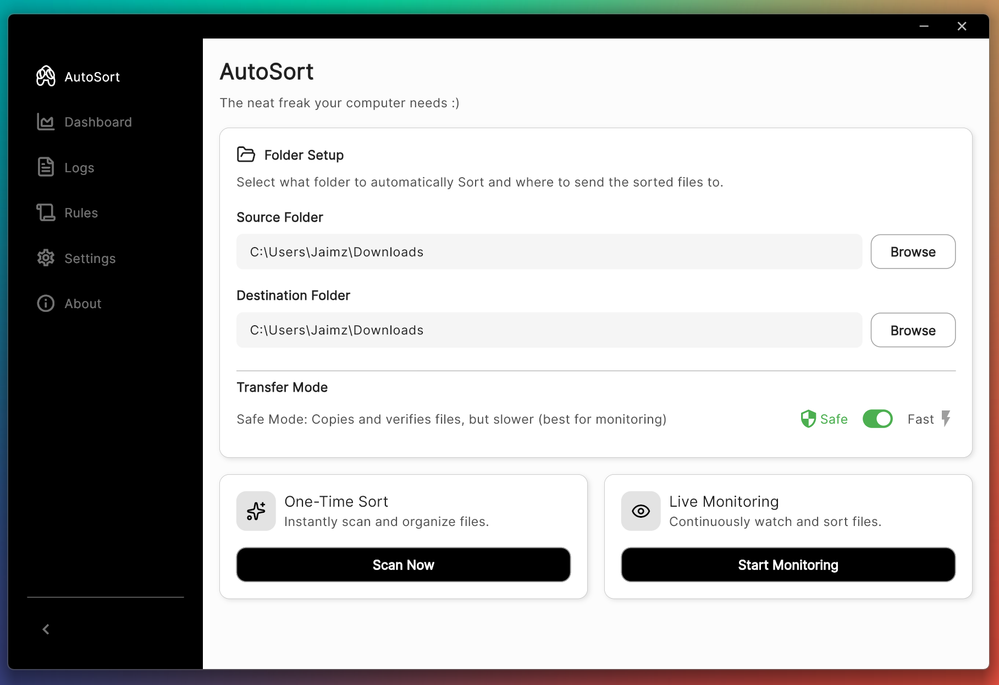

# 🧠 **AutoSort — The Neat Freak Your Computer Needs (A Smart Desktop Utility App)**

[](https://www.google.com/search?q=https://github.com/YOUR_USERNAME/autosort)
[](https://www.google.com/search?q=LICENSE)
[](https://www.google.com/search?q=https://github.com/YOUR_USERNAME/autosort/stargazers)

AutoSort is a **full-stack desktop utility app** built to keep your computer clean, organized, and clutter-free — automatically.
Think of it as the **neat freak your computer has always needed**. It sorts files by their file type into proper categories and keeps everything tidy with zero stress.

AutoSort combines:

  * A modern, responsive **Flutter desktop client**
  * A fast, reliable **Python backend (FastAPI)**
  * Real-time monitoring and intelligent file organization

Its mission is simple:
**Bring structure to digital chaos — with speed, safety, and style.**

-----

## 🚀 Key Features

### 🗂 **Intelligent File Organization & Control**

  * **Rule Engine:** Define custom rules to organize files by category and file extension.
  * **Exception Handling:** Specify file extensions that AutoSort should explicitly ignore.
  * **Duplicate Management:** Configure the service to either **Merge** duplicates or keep them **Separate**.
  * **Atomic Operations:** Ensures files are moved/copied correctly before deletion/finalization, with customizable processing delays.
  * **Modes of Operation:** Easily switch between **Manual "Sort Now"** mode and **Automated "Monitor"** mode for real-time changes.

### 📊 **Real-Time Monitoring & Visibility**

  * **Live Dashboard:** View real-time file counts organized by category (Documents, Videos, Images, Audio, Archives, etc.).
  * **Comprehensive Activity Logs:** Review all historical operations (sorts, scans, errors) with filtering by **All Logs**, **Errors**, **Scans**, or **Monitor** activity.
  * **API Health Status:** Includes a splash screen that checks the backend API health before loading the main application.

### 🖥 **Modern Desktop Client**

  * Built with **Flutter** for Windows, macOS, and Linux.
  * Dynamic, dark-themed UI using **Lucide Icons** and custom color schemes.
  * **Advanced Config Editor:** An in-app JSON editor allows power users to directly view and update the entire backend configuration.
  * Smooth user experience with **Snackbar Notifications** for successful operations and errors.

-----

### 📊 Screenshot


-----

## 🏗 Project Structure

```
AUTOSORT/
│
├── client/
│   └── autosort/                # Flutter desktop utility app
│       ├── lib/                 # UI, pages, widgets, services
│       ├── assets/              # Images, icons, fonts
│       ├── windows/ linux/ macos/
│       ├── pubspec.yaml
│       └── README.md            # (to be added later)
│
├── server/
│   └── AutoSort-File-Organizer/ # Python backend
│       ├── src/ or modules/     # File organization logic
│       ├── main.py              # API entry point
│       └── README.md            # (to be added later)
│
└── README.md                    # Root overview (this file)
```

-----

## 🔧 Tech Stack

### **Frontend (Utility App)**

  * **Flutter**
  * **Dart**
  * **Lucide Icons**
  * **Provider** (State Management)
  * **`code_text_field`** (For JSON Editor)

### **Backend (Organizer Service)**

  * **Python 3.x**
  * **FastAPI** (Local REST API)
  * **`pathlib` / `os`** (File System Operations)
  * **Hashing Library (e.g., `hashlib`):** For duplicate detection & file verification.

-----

## 📦 Installation & Setup

### 1️⃣ Clone the repo

```bash
git clone https://github.com/YOUR_USERNAME/autosort.git
cd autosort
```

### 2️⃣ Start the backend (Python)

> **It is highly recommended to use a Python virtual environment\!**

```bash
# Create and activate a virtual environment
python -m venv .venv
source .venv/bin/activate  # On Windows, use: .venv\Scripts\activate

cd server/AutoSort-File-Organizer
pip install -r requirements.txt
python main.py
```

### 3️⃣ Start the Flutter client

```bash
cd client/autosort
flutter pub get
# Use the flag corresponding to your operating system:
flutter run -d windows   # or -d macos, -d linux
```

-----

## 💡 How AutoSort Works

1.  The Python backend scans your target folders
2.  It categorizes files based on configured **Rules**
3.  AutoSort performs safe, **atomic operations** (copy → verify → replace)
4.  The Flutter client displays live stats, categories, and actions
5.  You control operations such as:
      * Sort Files (Manual Trigger)
      * Monitor File Changes (Automated)
      * Manage **Rules** and **Exceptions**
      * **Merge/Keep** Duplicates

AutoSort stays lightweight, fast, and dependable — exactly how a utility app should be.

-----

## 🗺 Roadmap/Todo

  * [ ] Background-service mode with system tray
  * [ ] Make an actual python library that can be installed


-----

## 🤝 Contributing

Contribution guidelines will be added in v1.0.
Pull requests are welcome once the architecture is stabilized.

-----

## 📜 License

MIT License — free for personal and commercial use.

-----

## ⭐ Final Notes

AutoSort is designed to be a **practical, everyday desktop utility** — install it once and let it silently keep your system neat, organized, and stress-free.

-----
